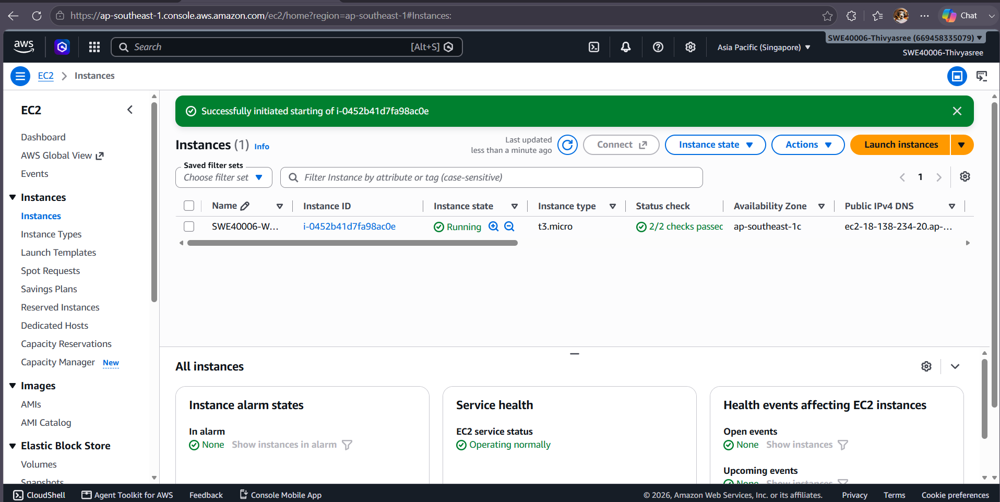
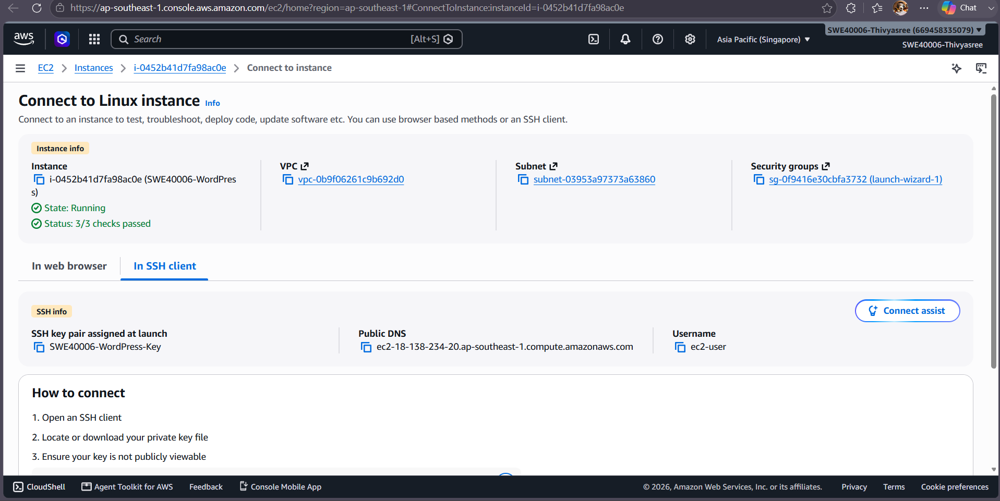
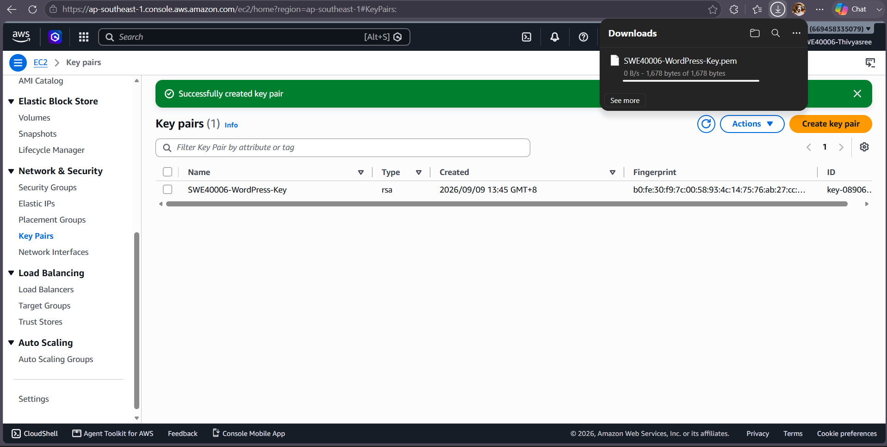
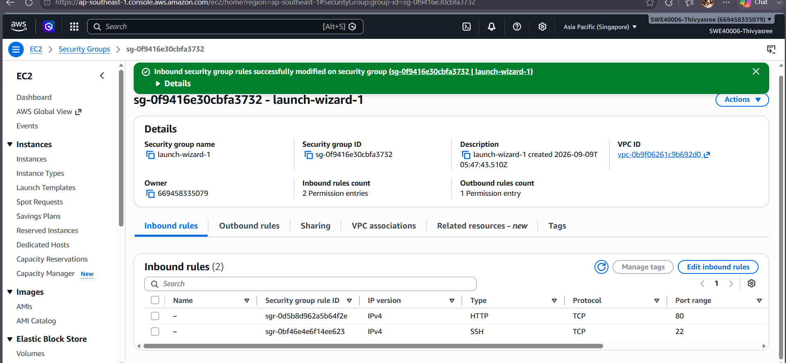
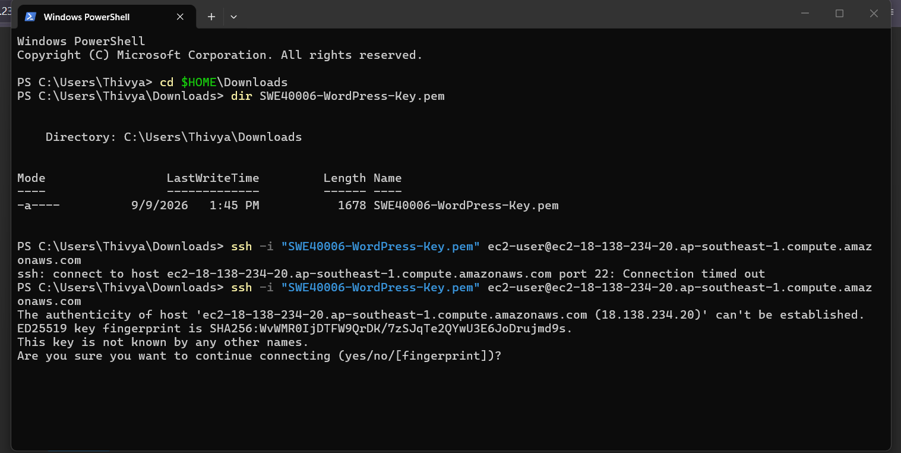
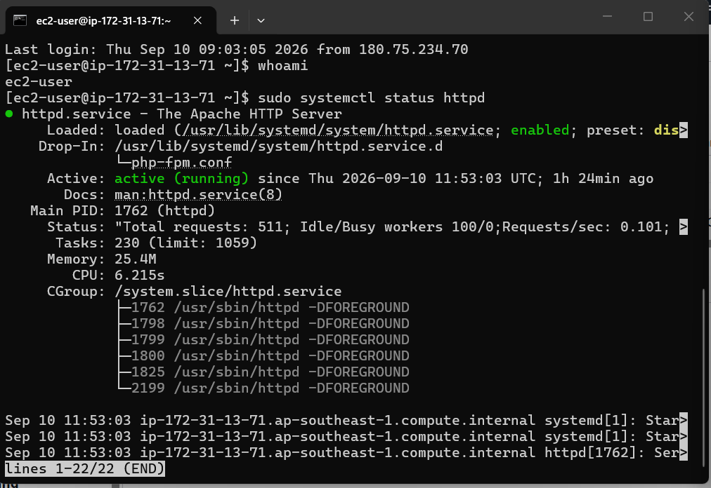
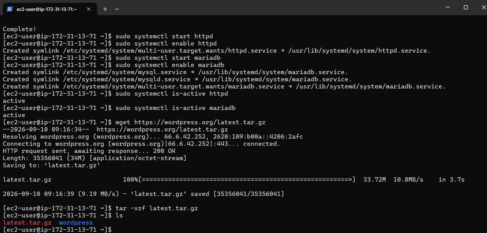
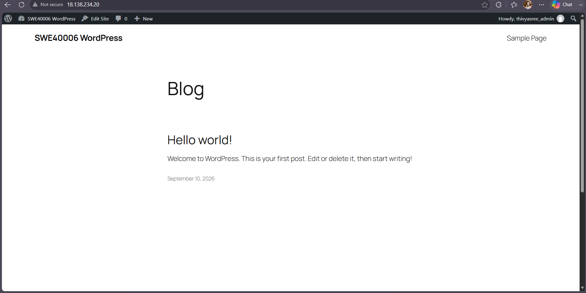

# Task 2.1 – EC2 and WordPress Deployment

## Objective

The objective of Task 2.1 was to create an AWS EC2 instance and deploy a working WordPress website on it.

This task established the initial environment that was later extended with RDS, load balancing, S3 backup and Auto Scaling.

---

## AWS Resources Used

- Amazon EC2
- Amazon Linux 2023
- EC2 Key Pair
- Security Group
- Apache HTTP Server
- PHP
- MariaDB
- WordPress

---

## 1. EC2 Instance Creation

I created an Amazon EC2 instance in the **Asia Pacific (Singapore) – ap-southeast-1** region.

The instance was named:

`SWE40006-WordPress`

Amazon Linux 2023 was selected as the operating system.

The EC2 instance provided the virtual server used to host the WordPress application.

### Evidence



**Figure 1:** EC2 instance created for the WordPress deployment.



**Figure 2:** Details of the WordPress EC2 instance.

---

## 2. SSH Key Pair

I created an EC2 key pair named:

`SWE40006-WordPress-Key`

The private key was stored securely on my Windows computer and was used to authenticate SSH connections to the EC2 instance.

The private `.pem` key is not included in this GitHub repository.

### Evidence



**Figure 3:** SSH key pair used for EC2 access.

---

## 3. Security Group Configuration

The EC2 security group was configured to allow the required network traffic.

The main inbound rules were:

| Type | Protocol | Port | Purpose |
|---|---|---:|---|
| HTTP | TCP | 80 | Allow users to access WordPress |
| SSH | TCP | 22 | Allow remote administration from my computer |

For security, SSH access was restricted to my current public IP address instead of allowing SSH from all IP addresses.

### Evidence



**Figure 4:** Security group rules configured for HTTP and SSH access.

---

## 4. SSH Connection from Windows

I connected to the EC2 instance from Windows using SSH.

Example command:

```bash
ssh -i "SWE40006-WordPress-Key.pem" ec2-user@<EC2-PUBLIC-DNS>
```

After successful authentication, the terminal displayed the Amazon Linux command prompt.

### Evidence



**Figure 5:** Successful SSH connection from Windows to the EC2 instance.

---

## 5. Web Server and Database Services

Apache, PHP and MariaDB were installed to provide the environment required by WordPress.

The Apache web server was started and enabled using:

```bash
sudo systemctl start httpd
sudo systemctl enable httpd
```

MariaDB was also started and enabled during the initial WordPress deployment:

```bash
sudo systemctl start mariadb
sudo systemctl enable mariadb
```

The services were checked using:

```bash
sudo systemctl is-active httpd
sudo systemctl is-active mariadb
```

The output confirmed that the required services were active.

### Evidence



**Figure 6:** Apache and MariaDB services running on the EC2 instance.

---

## 6. WordPress Installation

WordPress was installed under the Apache web directory:

```text
/var/www/html
```

The WordPress files were configured so that Apache could serve the application through HTTP.

The directory contents were checked from the command line to verify that the WordPress files had been installed successfully.

### Evidence



**Figure 7:** WordPress application files located in `/var/www/html`.

---

## 7. WordPress Verification

After completing the configuration, I accessed the EC2 instance through a web browser.

The WordPress website loaded successfully, confirming that:

- The EC2 instance was running.
- HTTP traffic could reach the instance.
- Apache was working.
- PHP was available.
- WordPress was installed correctly.

### Evidence



**Figure 8:** WordPress successfully running on the EC2 instance.

---

## Troubleshooting

### SSH Connection Timeout

During testing, an SSH connection timed out because my public IP address had changed.

The EC2 security group still allowed SSH access only from the previous IP address.

I updated the SSH inbound rule to use my current public IP address. After the security group rule was updated, the SSH connection worked again.

### Windows Private Key Permissions

Windows SSH also reported that the `.pem` private key permissions were too open.

I corrected the permissions using:

```powershell
icacls "SWE40006-WordPress-Key.pem" /inheritance:r
icacls "SWE40006-WordPress-Key.pem" /grant:r "$($env:USERNAME):(R)"
```

After changing the permissions, SSH authentication succeeded.

This troubleshooting demonstrated the importance of both network security group rules and local private-key permissions when administering EC2 instances.

---

## Task 2.1 Result

Task 2.1 was completed successfully.

A working WordPress website was deployed on an Amazon EC2 instance and could be accessed through a web browser. SSH command-line access was also successfully configured from Windows.

This EC2 WordPress deployment was then used as the foundation for the RDS, load-balancing, backup and Auto Scaling work completed in the later tasks.
