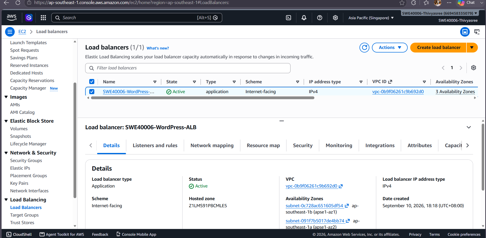
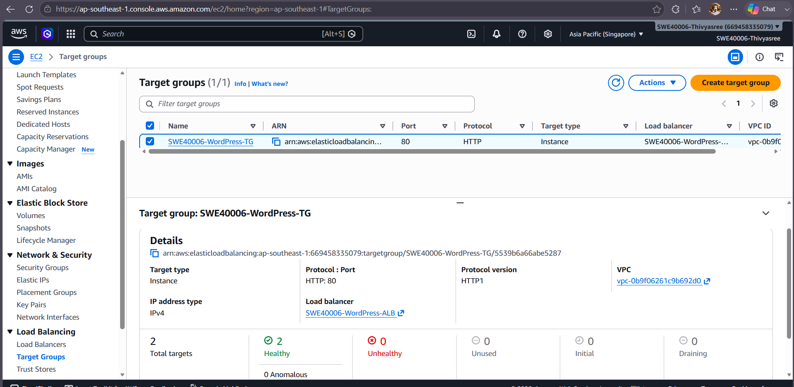
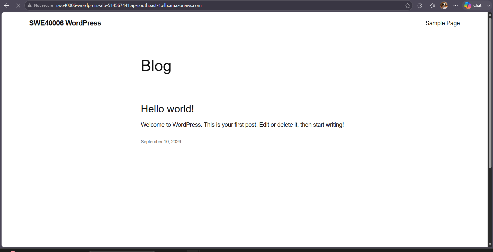
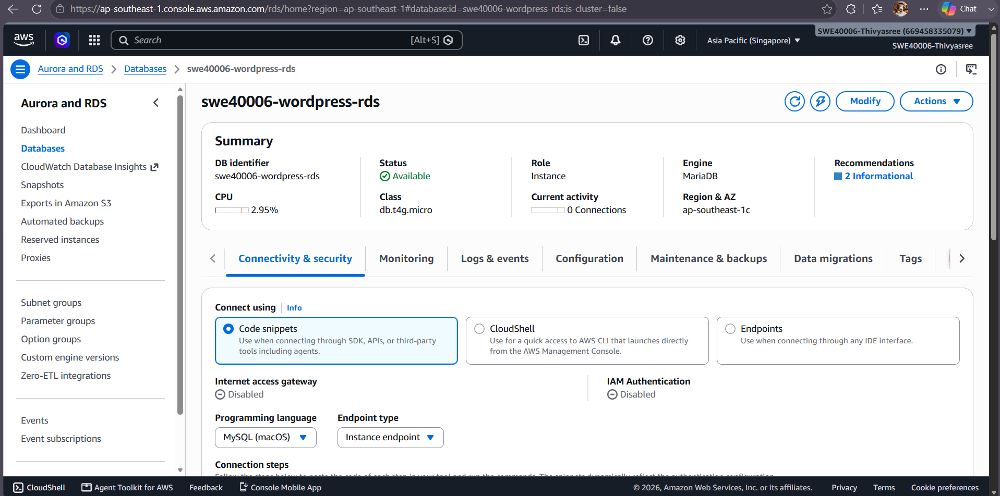
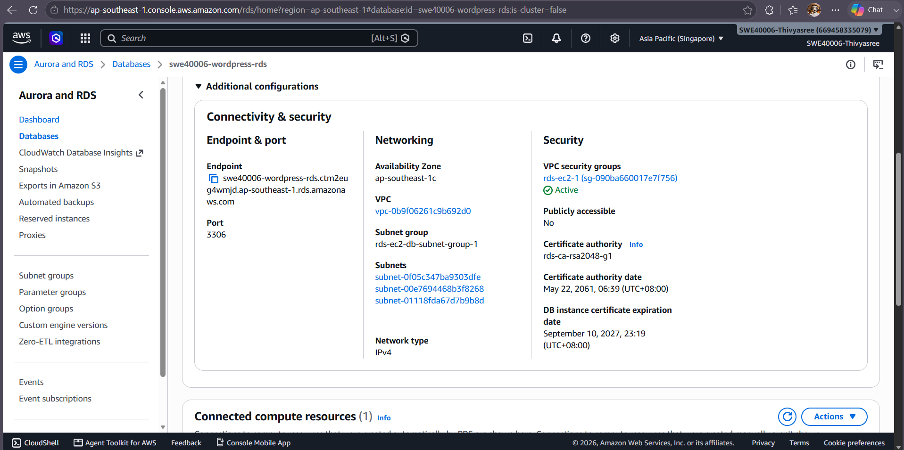
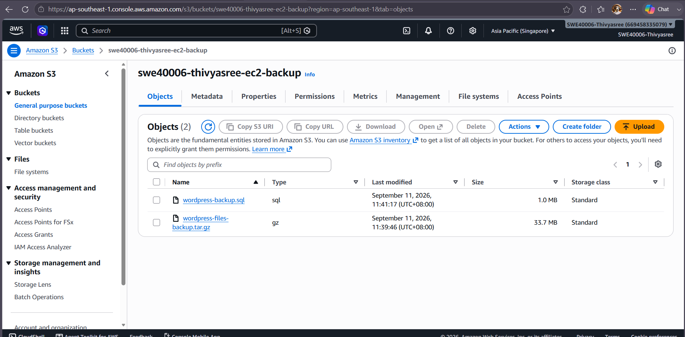
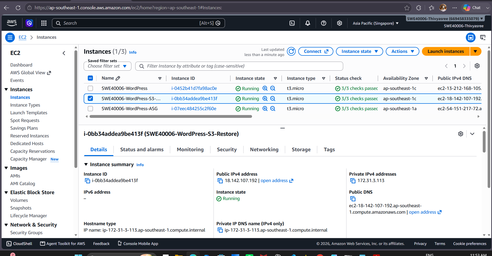
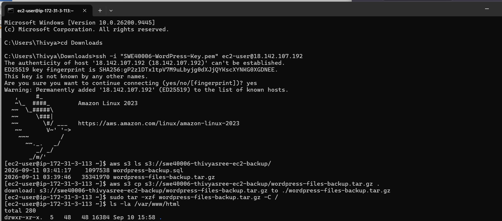
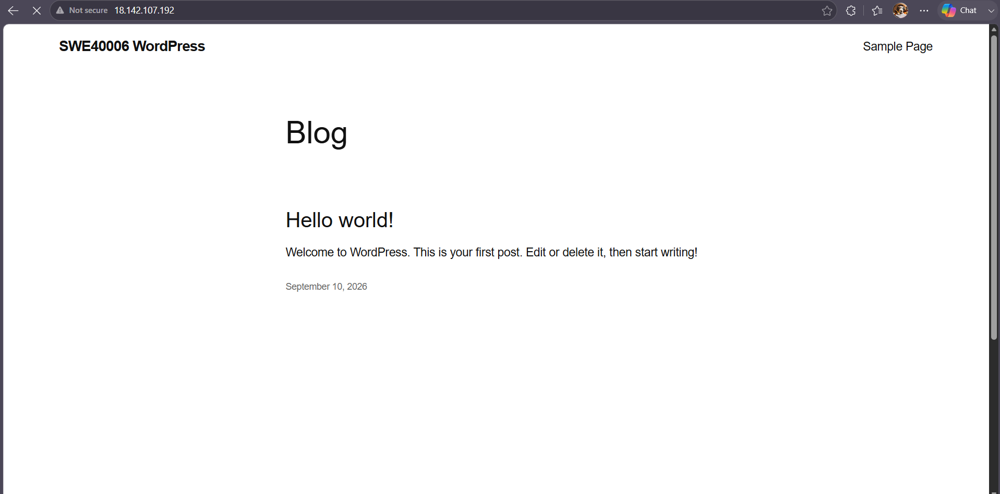

# Task 2.2 – Load Balancer, RDS and S3 Backup/Restore

## Objective

The objective of Task 2.2 was to extend the original WordPress deployment by adding load balancing, moving the WordPress database to an external Amazon RDS database, backing up the deployment to Amazon S3, and restoring the application on another EC2 instance.

This task demonstrates a more reliable deployment architecture by separating the application, database and backup storage.

---

## AWS Resources Used

- Amazon EC2
- Application Load Balancer (ALB)
- Target Group
- Amazon RDS for MariaDB
- Amazon S3
- IAM Role
- Security Groups
- WordPress
- Apache HTTP Server

---

## 1. Application Load Balancer

I created an internet-facing Application Load Balancer named:

`SWE40006-WordPress-ALB`

The load balancer was configured in the same VPC as the WordPress EC2 deployment and used multiple Availability Zones.

HTTP traffic on port `80` was configured for the WordPress application.

The Application Load Balancer provides a stable endpoint for users instead of requiring direct access to an individual EC2 instance.

### Evidence



**Figure 1:** Application Load Balancer created for the WordPress deployment.

---

## 2. Target Group Configuration

I created a target group named:

`SWE40006-WordPress-TG`

The target group used:

- Target type: Instance
- Protocol: HTTP
- Port: 80

The WordPress EC2 instance was registered with the target group.

The health check confirmed that the WordPress server was healthy and able to receive traffic from the load balancer.

### Evidence



**Figure 2:** WordPress target registered and reported as healthy.

---

## 3. WordPress Through the Load Balancer

After the target became healthy, I accessed WordPress using the Application Load Balancer DNS name.

The website loaded successfully through the load balancer.

This confirmed that:

- The ALB listener was working.
- The target group was configured correctly.
- The EC2 instance was healthy.
- HTTP traffic could be forwarded from the ALB to WordPress.

### Evidence



**Figure 3:** WordPress successfully accessed through the Application Load Balancer.

---

## 4. External Amazon RDS Database

The next stage was to move the WordPress database away from the local EC2 MariaDB service.

I created an Amazon RDS database using MariaDB.

The database identifier was:

`swe40006-wordpress-rds`

The RDS instance was placed inside the same VPC as the WordPress application.

For security, the RDS database was configured as **not publicly accessible**.

Database traffic used MariaDB port:

`3306`

### Evidence



**Figure 4:** Amazon RDS MariaDB database created for WordPress.

---

## 5. RDS Connectivity

The EC2 instance required network permission to communicate with the RDS database.

Security groups were configured so that the WordPress EC2 instance could communicate with RDS on TCP port `3306`.

During command-line testing, RDS required secure transport. A normal MariaDB connection was therefore replaced with an SSL connection.

Example:

```bash
mariadb --ssl -h <RDS-ENDPOINT> -u admin -p
```

After using SSL and configuring the security groups correctly, the connection to Amazon RDS succeeded.

### Evidence



**Figure 5:** RDS configuration/connectivity used by the WordPress deployment.

---

## 6. Migrating the WordPress Database to RDS

The existing WordPress database was exported from the original EC2 instance.

The database backup file was:

```text
wordpress-backup.sql
```

The database was then imported into the RDS MariaDB instance.

The WordPress configuration file:

```text
/var/www/html/wp-config.php
```

was updated so that WordPress used the external RDS endpoint instead of the local MariaDB database.

The important configuration values included:

```text
DB_NAME = wordpress
DB_USER = admin
DB_HOST = <RDS-ENDPOINT>
```

Passwords are intentionally not included in this repository.

Because RDS required SSL, WordPress was also configured to use SSL for the database connection.

After migration, the local MariaDB service on the original EC2 instance was stopped during testing. WordPress continued to operate, confirming that the application was using the external RDS database.

---

## 7. S3 Backup

After the RDS migration, I created a backup of the WordPress deployment and stored it in Amazon S3.

The S3 bucket used for the backup was:

`swe40006-thivyasree-ec2-backup`

The backup contained:

```text
wordpress-backup.sql
wordpress-files-backup.tar.gz
```

The SQL file contains the WordPress database backup, while the compressed archive contains the WordPress application files.

An IAM role was attached to the EC2 instance so that AWS CLI commands could access the S3 bucket without storing AWS access keys directly on the server.

### Example Commands

Check the S3 bucket:

```bash
aws s3 ls s3://swe40006-thivyasree-ec2-backup/
```

Upload a backup:

```bash
aws s3 cp wordpress-backup.sql s3://swe40006-thivyasree-ec2-backup/
```

```bash
aws s3 cp wordpress-files-backup.tar.gz s3://swe40006-thivyasree-ec2-backup/
```

### Evidence



**Figure 6:** WordPress database and application backups stored in Amazon S3.

---

## 8. Creating a Restore EC2 Instance

To demonstrate recovery from the S3 backup, I created another EC2 instance.

The restored instance was named:

`SWE40006-WordPress-S3-Restore`

This provided a separate server on which the WordPress application could be recovered from the backup.

### Evidence



**Figure 7:** Separate EC2 instance created for the S3 restoration test.

---

## 9. Restoring WordPress from S3

I connected to the restore EC2 instance using SSH and accessed the S3 backup using AWS CLI.

The available backup files were checked using:

```bash
aws s3 ls s3://swe40006-thivyasree-ec2-backup/
```

The WordPress archive was downloaded using:

```bash
aws s3 cp s3://swe40006-thivyasree-ec2-backup/wordpress-files-backup.tar.gz .
```

The files were then extracted:

```bash
sudo tar -xzf wordpress-files-backup.tar.gz -C /
```

The restored WordPress files were checked using:

```bash
ls -la /var/www/html
```

### Evidence



**Figure 8:** AWS CLI and Linux commands used to restore WordPress from the S3 backup.

---

## 10. Restore Troubleshooting

The restored EC2 instance initially could not communicate successfully with the RDS database.

Testing produced:

```text
HTTP/1.1 504 Gateway Timeout
```

Further network testing showed:

```text
RDS PORT BLOCKED
```

The cause was the RDS security group. The restored EC2 instance used a different security group, and this security group had not yet been permitted to connect to RDS.

I updated the RDS security group to allow TCP port `3306` from the security group used by the restored EC2 instance.

After the rule was updated, testing showed:

```text
RDS PORT OPEN
```

The website test then returned:

```text
HTTP/1.1 200 OK
```

### Evidence


**Figure 9:** Troubleshooting the restored instance from blocked RDS connectivity to a successful HTTP 200 response.

---

## 11. Restored WordPress Verification

After the files and database connectivity were restored, the new EC2 instance was tested through a web browser.

The WordPress website loaded successfully.

This demonstrated that the WordPress application could be recovered on another EC2 instance using the backup stored in Amazon S3 while continuing to use the external Amazon RDS database.

### Evidence



**Figure 10:** WordPress successfully running on the restored EC2 instance.

---

## Additional Troubleshooting

### Load Balancer Target Initially Unused

During the initial ALB configuration, the WordPress target appeared as unused.

The EC2 instance was located in an Availability Zone that had not been enabled for the Application Load Balancer.

I added the required subnet and Availability Zone to the ALB configuration. After this change, the target became healthy.

### RDS Secure Transport Requirement

A normal MariaDB connection to RDS initially failed because the RDS server required secure transport.

The connection was changed to:

```bash
mariadb --ssl -h <RDS-ENDPOINT> -u admin -p
```

This allowed a secure connection to the database.

### SELinux Database Connectivity

Apache initially had difficulty communicating with the external RDS database.

The SELinux setting for HTTP database network connections was checked and enabled using:

```bash
sudo setsebool -P httpd_can_network_connect_db 1
```

This allowed Apache/PHP to establish the required network database connection.

### WordPress HTTP 500 Error

After the RDS migration, WordPress returned an HTTP 500 error.

Command-line PHP testing identified an incorrect constant in `wp-config.php`.

Incorrect:

```php
MYSQL_CLIENT_SSL
```

Correct:

```php
MYSQLI_CLIENT_SSL
```

After correcting the constant, the WordPress application successfully returned:

```text
HTTP/1.1 200 OK
```

---

## Task 2.2 Result

Task 2.2 was completed successfully.

The WordPress deployment was extended with:

- An Application Load Balancer
- A healthy WordPress target group
- An external Amazon RDS MariaDB database
- Migration of the existing WordPress database to RDS
- Amazon S3 backup storage
- A separate EC2 restoration test
- Successful WordPress recovery from the S3 backup

The troubleshooting performed during this task also demonstrated investigation of load-balancer configuration, SSL database connections, SELinux, WordPress configuration and AWS security-group connectivity.
