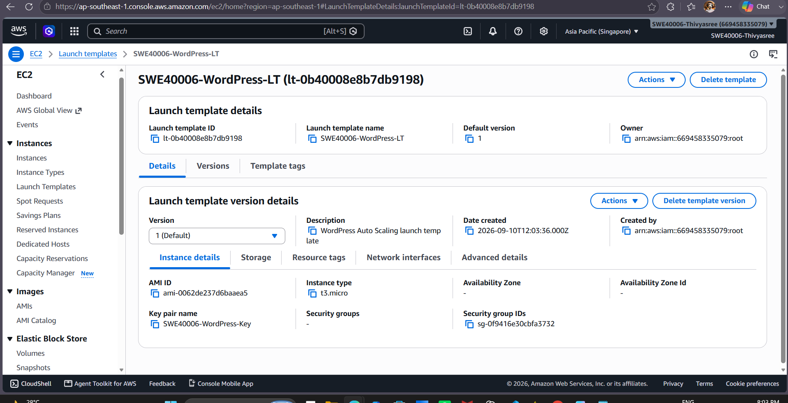
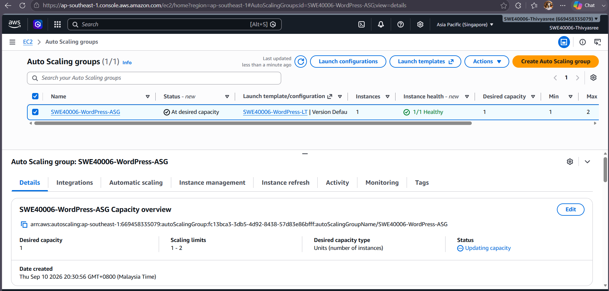
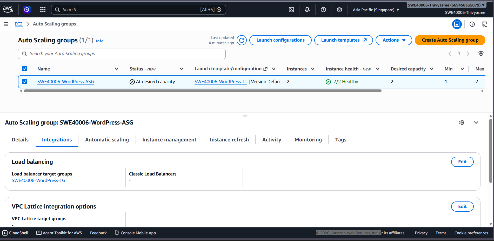
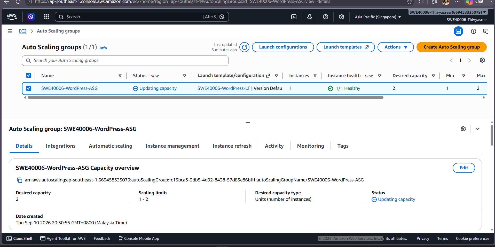
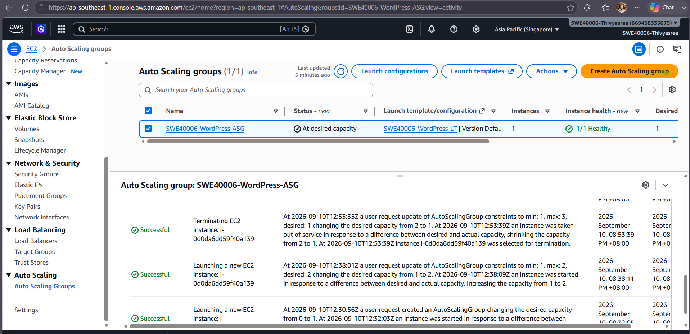
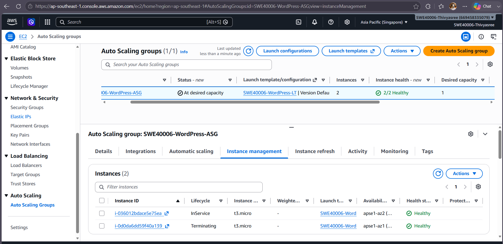

# Task 2.3 – Launch Template and Auto Scaling

## Objective

The objective of Task 2.3 was to extend the AWS WordPress deployment by creating a Launch Template and an Auto Scaling Group (ASG).

The Auto Scaling Group was configured to launch EC2 instances automatically and was tested by changing the desired capacity. This demonstrated both scale-out and scale-in operations.

---

## AWS Resources Used

- Amazon EC2
- EC2 Launch Template
- Auto Scaling Group (ASG)
- Application Load Balancer
- Target Group
- Security Groups
- WordPress

---

## 1. Launch Template

I created an EC2 Launch Template named:

`SWE40006-WordPress-LT`

A Launch Template stores the configuration required when AWS launches new EC2 instances.

The template included the required EC2 configuration for the WordPress environment, such as the machine image, instance type, key pair and security configuration.

The Launch Template was then used by the Auto Scaling Group to create EC2 instances.

### Evidence



**Figure 1:** EC2 Launch Template created for the WordPress Auto Scaling deployment.

---

## 2. Auto Scaling Group

I created an Auto Scaling Group named:

`SWE40006-WordPress-ASG`

The Auto Scaling Group used the previously created Launch Template.

The ASG was configured with minimum, desired and maximum capacity values so that AWS could control the number of running EC2 instances.

The initial configuration used a desired capacity of one instance.

The maximum capacity was configured as three instances, allowing additional instances to be launched during scaling tests.

### Evidence



**Figure 2:** Auto Scaling Group configuration showing its capacity settings.

---

## 3. Target Group Integration

The Auto Scaling Group was associated with the WordPress target group:

`SWE40006-WordPress-TG`

This integration allows EC2 instances launched by the Auto Scaling Group to be registered with the target group and receive traffic through the Application Load Balancer.

This is important because newly launched instances must become part of the load-balanced deployment rather than operating as independent servers.

### Evidence



**Figure 3:** Auto Scaling Group associated with the WordPress target group.

---

## 4. Initial Auto Scaling Test

After the Auto Scaling Group was created, AWS launched an EC2 instance using the Launch Template.

The ASG showed that the instance was healthy and that the group had reached its desired capacity.

This confirmed that:

- The Launch Template could be used successfully.
- The Auto Scaling Group could create EC2 instances.
- The launched instance could become healthy.
- The ASG could maintain the configured desired capacity.

---

## 5. Scale-Out Test

To test scaling, I manually changed the desired capacity from:

```text
1 instance
```

to:

```text
2 instances
```

The Auto Scaling Group detected that the number of running instances was lower than the new desired capacity.

AWS automatically launched another EC2 instance.

After the launch process completed, two Auto Scaling EC2 instances were running.

The instances were also distributed across different Availability Zones, demonstrating how Auto Scaling can work with a multi-AZ deployment.

### Evidence



**Figure 4:** Auto Scaling Group scaled out from one EC2 instance to two instances.

---

## 6. Auto Scaling Activity History

The Auto Scaling activity history was used to verify that the scaling operations were performed by AWS.

During the scale-out test, the activity history showed that a new EC2 instance was launched after the desired capacity was increased.

This provides evidence that the Auto Scaling Group responded correctly to the capacity change.

### Evidence



**Figure 5:** Auto Scaling activity history showing instance launch and termination activities.

---

## 7. Scale-In Test

After verifying the scale-out operation, I changed the desired capacity back from:

```text
2 instances
```

to:

```text
1 instance
```

The Auto Scaling Group detected that there were more running instances than required.

AWS automatically selected and terminated one of the Auto Scaling instances.

The activity history confirmed the termination.

This demonstrated a successful **scale-in operation**.

Therefore, both directions of scaling were tested:

| Test | Desired Capacity | Result |
|---|---:|---|
| Initial state | 1 | One ASG instance running |
| Scale out | 2 | Second EC2 instance automatically launched |
| Scale in | 1 | Additional EC2 instance automatically terminated |

---

## 8. Target Group Health

The target group was checked during the Auto Scaling deployment.

Healthy targets demonstrate that the load-balancing environment can identify EC2 instances that are able to receive application traffic.

### Evidence



**Figure 6:** Target group health during the Auto Scaling deployment.

---

## How Auto Scaling Works in This Deployment

The deployment uses the following relationship:

```text
User
  |
  v
Application Load Balancer
  |
  v
WordPress Target Group
  |
  v
Auto Scaling Group
  |
  v
EC2 Instances
```

The **Launch Template** defines how a new EC2 instance should be created.

The **Auto Scaling Group** determines how many EC2 instances should exist.

The **Target Group** identifies the instances that can receive HTTP traffic.

The **Application Load Balancer** distributes incoming traffic to healthy targets.

Together, these components provide a deployment architecture that can increase or decrease the number of application servers when required.

---

## Scaling Verification

The scaling test demonstrated the following sequence:

```text
Desired Capacity = 1
        |
        v
1 EC2 instance running
        |
        v
Desired Capacity changed to 2
        |
        v
AWS launches another EC2 instance
        |
        v
2 EC2 instances running
        |
        v
Desired Capacity changed back to 1
        |
        v
AWS terminates one EC2 instance
        |
        v
1 EC2 instance remains
```

The successful launch and termination activities confirmed that the Auto Scaling Group was functioning correctly.

---

## Task 2.3 Result

Task 2.3 was completed successfully.

The deployment included:

- An EC2 Launch Template
- An Auto Scaling Group
- Integration with the WordPress target group
- Automatic EC2 instance creation
- A successful scale-out test from one to two instances
- A successful scale-in test from two to one instance
- Verification through Auto Scaling activity history and target health

The results demonstrate that AWS Auto Scaling can automatically manage the number of EC2 instances according to the configured desired capacity.
