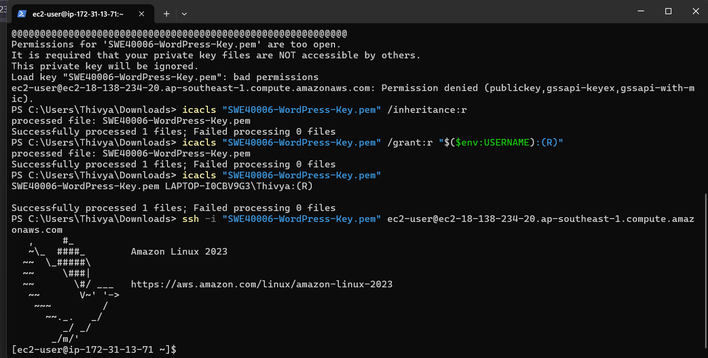
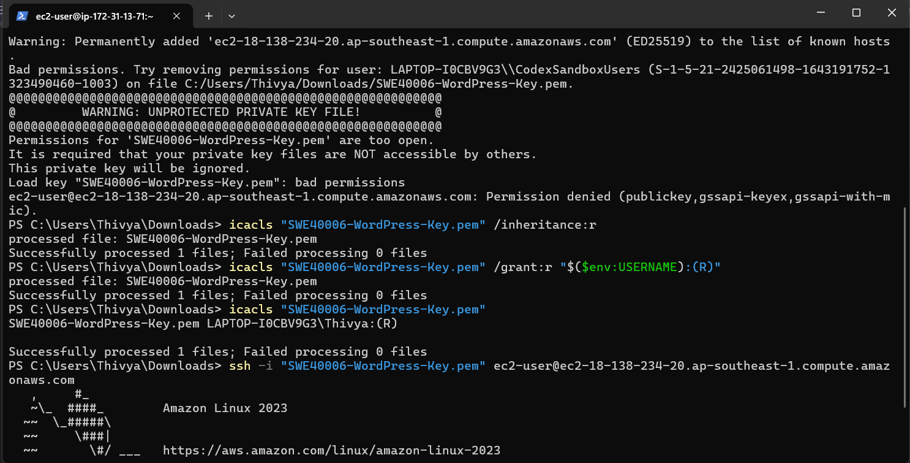
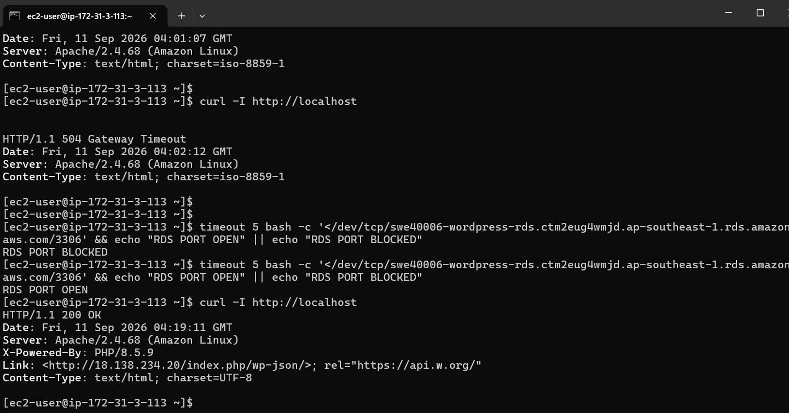
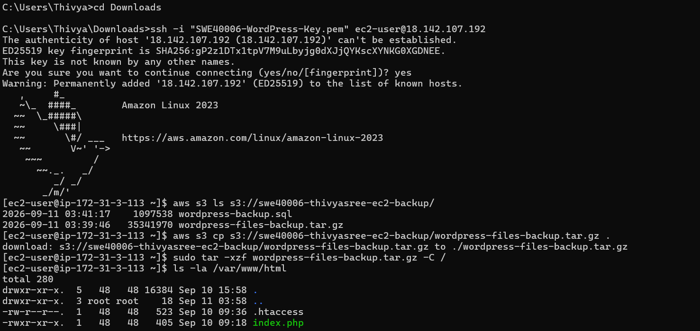
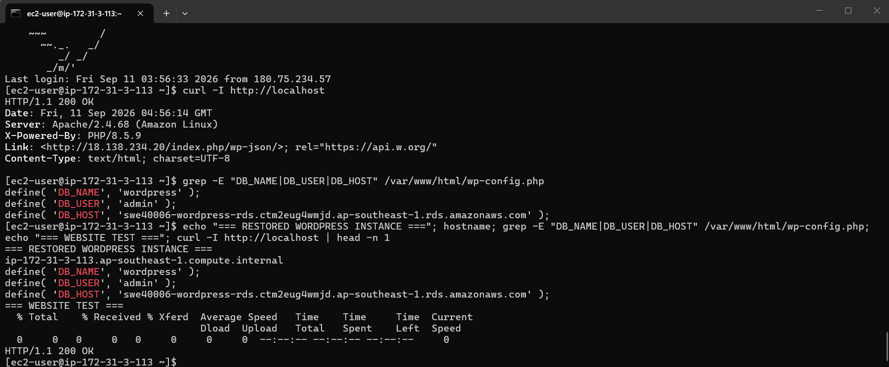

# Task 2.4 – SSH and Command-Line Administration

## Objective

The objective of Task 2.4 was to demonstrate SSH access to the AWS EC2 deployment from a Windows computer and show command-line interactions used to manage, test and troubleshoot the WordPress environment.

SSH was used throughout the deployment to administer the EC2 instances, verify services, access Amazon S3 backups and test the restored WordPress application.

---

## Tools Used

- Windows Command Prompt / PowerShell
- OpenSSH
- Amazon EC2
- Amazon Linux 2023
- EC2 SSH Key Pair
- AWS CLI
- Linux command-line tools
- Apache HTTP Server
- Amazon S3
- Amazon RDS

---

## 1. SSH Access from Windows

The EC2 instances were accessed remotely from Windows using SSH.

The SSH key pair used for the deployment was:

`SWE40006-WordPress-Key`

A typical SSH command was:

```bash
ssh -i "SWE40006-WordPress-Key.pem" ec2-user@<EC2-PUBLIC-DNS>
```

The private `.pem` file was stored locally on my Windows computer and was not uploaded to this GitHub repository.

After successful authentication, the Amazon Linux command prompt was available and I could administer the EC2 instance remotely.

### Evidence



**Figure 1:** Successful SSH connection from Windows to an Amazon Linux EC2 instance.

---

## 2. SSH Private Key Permission Problem

During the SSH setup, Windows reported that the private key file permissions were too open.

The SSH client rejected the key because other Windows users could potentially access the private key.

The permissions were corrected using:

```powershell
icacls "SWE40006-WordPress-Key.pem" /inheritance:r
icacls "SWE40006-WordPress-Key.pem" /grant:r "$($env:USERNAME):(R)"
```

The first command removed inherited permissions.

The second command granted read permission to my Windows user account.

After correcting the file permissions, the SSH connection succeeded.

### Evidence



**Figure 2:** SSH private-key permission problem and Windows permission correction.

---

## 3. WordPress Command-Line Verification

After connecting through SSH, command-line tools were used to verify that the WordPress web server was responding correctly.

For example:

```bash
curl -I http://localhost
```

A successful response returned:

```text
HTTP/1.1 200 OK
```

This confirmed that the Apache web server was responding successfully from inside the EC2 instance.

Other useful commands included:

```bash
sudo systemctl status httpd
```

and:

```bash
sudo systemctl is-active httpd
```

These commands were used to check whether the Apache service was running.

### Evidence



**Figure 3:** WordPress and Apache verified through SSH command-line testing.

---

## 4. S3 Backup and Restore Using AWS CLI

SSH was also used to perform backup and restoration operations.

The contents of the S3 backup bucket were checked using:

```bash
aws s3 ls s3://swe40006-thivyasree-ec2-backup/
```

The WordPress backup archive was downloaded from S3 using:

```bash
aws s3 cp s3://swe40006-thivyasree-ec2-backup/wordpress-files-backup.tar.gz .
```

The downloaded WordPress files were restored using:

```bash
sudo tar -xzf wordpress-files-backup.tar.gz -C /
```

The restored files were then checked using:

```bash
ls -la /var/www/html
```

These commands demonstrate the use of both AWS CLI and Linux commands through an SSH session.

### Evidence


**Figure 4:** AWS S3 and Linux restoration commands executed through SSH.

---

## 5. RDS Command-Line Testing

Command-line testing was also used while configuring the external Amazon RDS database.

The RDS MariaDB service required a secure connection.

An example connection command was:

```bash
mariadb --ssl -h <RDS-ENDPOINT> -u admin -p
```

The `-p` option requests the password securely at the terminal rather than storing the password directly in the command.

Database and network testing helped identify configuration problems during the WordPress RDS migration and restore process.

### Evidence



**Figure 5:** Command-line testing associated with the external RDS database.

---

## 6. Restored Instance Verification

The restored WordPress EC2 instance was also verified through SSH.

The hostname was checked to confirm that the commands were being executed on the restored instance.

WordPress database configuration values were checked without displaying the database password.

For example:

```bash
grep -E "DB_NAME|DB_USER|DB_HOST" /var/www/html/wp-config.php
```

This confirmed that WordPress was configured to use:

- Database name: `wordpress`
- Database user: `admin`
- External Amazon RDS host

The application was then tested using:

```bash
curl -I http://localhost
```

The final result was:

```text
HTTP/1.1 200 OK
```

This demonstrated that the restored WordPress deployment was operational.

### Evidence



**Figure 6:** Final command-line verification of the restored WordPress instance and RDS configuration.

---

## Command-Line Troubleshooting

Command-line access was important for diagnosing several problems during the deployment.

### SSH Connection Timeout

An SSH connection initially timed out because my public IP address had changed.

The EC2 security group allowed SSH only from my previous IP address.

I updated the SSH inbound rule on port `22` to my current public IP address.

After the rule was updated, SSH connectivity was restored.

### Private Key Permission Error

The Windows SSH client rejected the `.pem` key because its permissions were too open.

The issue was corrected with `icacls`, after which the same key successfully authenticated to EC2.

### RDS Connectivity

Command-line testing was used to determine whether EC2 could communicate with RDS.

During the restored-instance test, database connectivity was initially blocked by the RDS security group.

After allowing TCP port `3306` from the restored EC2 security group, connectivity succeeded.

### WordPress HTTP Error

Command-line PHP testing was also used to investigate an HTTP 500 error after the RDS migration.

The problem was traced to an incorrect constant in `wp-config.php`.

Incorrect:

```php
MYSQL_CLIENT_SSL
```

Correct:

```php
MYSQLI_CLIENT_SSL
```

After correcting the configuration, WordPress returned:

```text
HTTP/1.1 200 OK
```

---

## Security Considerations

Several security practices were followed during SSH administration:

- The private `.pem` key was not uploaded to GitHub.
- SSH access was restricted to my public IP address.
- Passwords were not stored in the documentation.
- RDS was not made publicly accessible.
- RDS access was controlled using security groups.
- An IAM role was used for EC2 access to S3 rather than storing AWS access keys on the EC2 instance.

The repository `.gitignore` also excludes common sensitive files such as:

```text
*.pem
*.key
.env
*credentials*
*password*
```

---

## Task 2.4 Result

Task 2.4 was completed successfully.

SSH access from Windows to the AWS EC2 instances was demonstrated, and command-line interactions were used throughout the deployment for:

- EC2 administration
- Apache verification
- WordPress testing
- S3 backup access
- WordPress restoration
- RDS connectivity testing
- Troubleshooting
- Final deployment verification

The command-line evidence demonstrates successful remote administration of the AWS WordPress environment from Windows.
